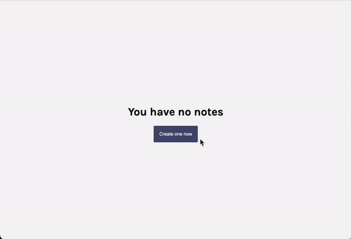
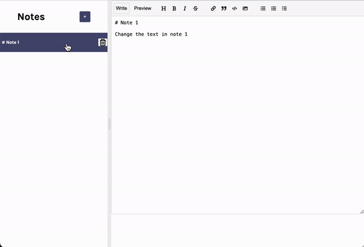

# Notes App

## Description
Built a feature-rich Notes app using React, empowering users to create, edit, and delete notes seamlessly with a Markdown editor. Leveraging Firebase, the app ensures secure storage and retrieval of user-generated content. Users can efficiently manage and preview their notes, making it a dynamic tool for organized and effective note-taking in a React-based environment

## Visual

** Create, add, edit, update and delete notes **

** Use Markdown tools and preview notes **

